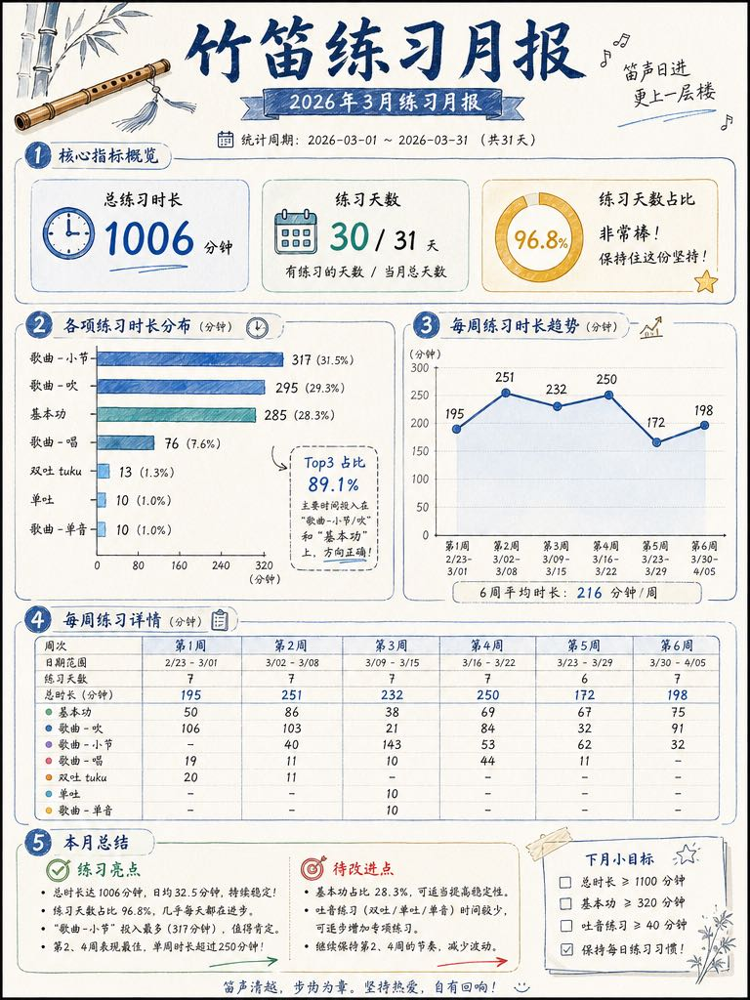
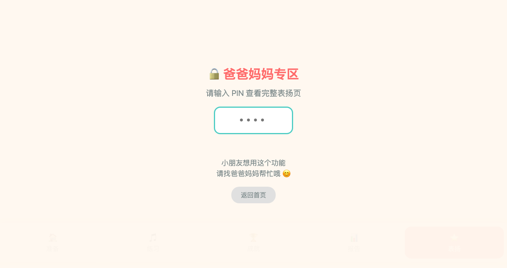

# 🎵 dizical

> 竹笛课程管理 + 缴费提醒 + Apple Reminders 双向同步 + iPad 儿童练习助手

<p align="center">
  
  
  
  
  
</p>

> 📝 **最近变更 (2026-08-12, v3.3.4):** Phase 1 web user auth 收尾 (login_page + register + 3 套环境密码同步) · CHANGELOG 修正文档引用 · GitHub 隐私清理 (STATUS/vibe/handoff 不再上 gh). 详见 [docs/CHANGELOG.md](docs/CHANGELOG.md).

---

## 🤔 为什么叫 dizical？

```
dizi + cal(endar) = dizical
  竹笛    日历        ↓
            发音 ≈ Descartes（笛卡尔）

📅 管它什么哲学，我只要管好我的竹笛课表 🎵
```

---

## ✨ Features

### Badge 引擎（V2.10，2026-07）
- 🏆 **40 枚 Enamel Pin 风格徽章** —— 连击/累计/段位/排行/节日/特殊 6 类
- 🔄 **实时 calc + 自动解锁** —— `calc_all()` 计算结果立刻持久化到 `achievement_stats` 表
- 📜 **小朋友视角文案** —— "你在 2025-10-03 第一次连着打卡 7 天" 而不是工程术语
- 🖼️ **图像替换 API** —— `POST /config/api/badge/replace-image-from-draft` 换老图不写 achievements;老图保留 (is_current=0)
- 🧒 **视觉设计** —— chibi girl + 笛子 + 高音谱号 + 星星/爱心装饰;1024×1024 RGBA + 硬 alpha mask 干净透明
- 📋 **来源**: dizical 后端 + `~/.hermes/profiles/dizical/skills/badge-image` (跨 profile symlinked)

### Web 用户认证（v3.3.4, 2026-08）
- 🔐 **登录页** —— `/login` 路由 + iPad 友好的卡片布局
- 🆕 **注册页** —— 自助注册 (Phase 1 内网环境, 3 套环境密码同步)
- 🔑 **密码哈希** —— PBKDF2-SHA256 (salted), 最低 6 位
- 🚪 **登出** —— 清除 session, 跳转回登录
- 📱 **响应式** —— iPhone Safari（440 CSS）/ iPad mini（744 竖 / 1133 横）/ MacBook Pro 16"（1728）同一套 kid-app HTML；窄屏汉堡抽屉

### 课程管理
- 📅 **自动排课** - 每周六自动生成课程，节假日冲突检测
- 💰 **缴费管理** - 自动统计欠缴/已缴，最后一节课当天提醒
- 📊 **可视化课表** - 表格视图 + ASCII 日历视图

### 练习追踪
- 🎵 **打卡** - 空格/逗号分隔多条记录，支持指定日期补录
- 📝 **进展记录** - 每次打卡可附上详细练习进展（`--log`）
- 🔍 **模糊匹配** - 打卡时只记得名字的一部分也能识别（如"单吐"匹配"单吐练习"）
- 🗓️ **日历热力图** - 月度练习日历，颜色深浅表示练习量
- 📈 **统计** - 月度练习时长、每日练习曲线

### 老师要求管理
- 📋 **每周要求录入** - 支持精准 ID（如 `1003:♩=82`）或名称匹配
- 🖼️ **配图支持** - 每次录入可附加多张练习图片（`-i img.jpg`）
- 📅 **阶段模型** - 每课周期自动关联 stage_start / stage_end / stage_order，显示更清晰

### 练习配置（TUI 菜单）
- 🏷️ **大科目/小科目** - 两级分类（气息练习→吸气长音/慢唱…）
- 📦 **归档管理** - 老曲目归档隐藏，新曲目启用，33条历史科目可随时查看/恢复
- ⚙️ **增删改查** - 交互式 TUI 菜单，支持重命名、排序、关联关系设置

### Apple Reminders 同步
- 🍎 **自然语言录入** - 在 Reminders 写"单吐10分钟"即可打卡
- 🔄 **双向同步** - `dizical reminders sync`

### /config/lessons（课程管理台）
- 📅 **课程日历** — 月历视图，彩色圆点标记状态，选日期后操作（添加/取消/确认上课/调课）
- ⚡ **生成计划** — 选择月份一键生成月度课程
- 📋 **课程列表** — 月份切换，每条可标记缴费状态
- 📊 **课程统计** — 本月安排/上课/取消数量 + 学费合计/已缴/待缴

### /config/records（练习记录管理台）
- 📅 **练习日历** — 月历热力图，点击查看当日练习明细
- ➕ **录入** — category + item 二级选择，填写分钟数
- ✏️ **编辑** — 修改历史记录，支持历史科目
- 📊 **统计** — 本周/本月练习时长和天数
- 🎨 **AI 生成信息图** - 多模板风格（学术/清新/运动/趣味），一键生成练习月报分享图
  

---

## 👧 dizical-kid（iPad 儿童界面）

面向 7 岁儿童的竹笛练习助手，运行在 iPad Safari。

```bash
# 启动服务
dizical kid start

# iPad 访问
# http://<本机IP>:8765
```

### 页面概览

**`/prepare` 准备页**
- GSAP ScrollTrigger 滚动动画，依次淡入各区块
- 每日鼓励语（12条，从池中按日期选取）
- 今日准备步骤勾选（点击即勾，localStorage 每日重置）
- 本周老师要求展示，配图可点击放大

**`/practice` 练习打卡页**
- 选择小科目 → 设置时长 → 开始计时
- 计时结束页面固定锁定，防止提前退出
- 支持加时练习（`+5min`）
- 快速打卡：选科目→输时长→提交，无需计时

**`/achievements` 成就殿堂（7 格看板）**
| 格 | 内容 | 说明 |
|----|------|------|
| 1 | 已连续练习 | 从昨天倒查，病假/未练不中断 |
| 2 | 比上周多/少 | 本周 vs 上周课时数对比 |
| 3 | 比上月多/少 | 本月 vs 上月同期对比 |
| 4 | 累计练习 | 历史总课时 |
| 5 | 昨日 TOP3 | 昨日练习时长前三科目 |
| 6 | 本周 TOP3 | 本周累计时长前三科目 |
| 7 | 本月 TOP3 | 本月累计时长前三科目 |

**`/badges` 勋章墙**
- 40 枚 Enamel Pin 风格徽章，实时计算解锁状态
- 分类展示：连击系 / 累计系 / 段位系 / 排行系 / 节日系 / 特殊徽章
- 顶部进度条：年度总课时进度（1000分钟里程碑）
- 点击徽章弹出详情（解锁条件 / 当前进度 / 达成日期 / 典故描述）
- 未解锁徽章显示锁定态（CSS grayscale 滤镜，HTML 不生成 locked 图)

徽章一览：
- 连击系：`streak_1/3/7/14/30/100`（1天～100天）
- 累计系：`total_60/300/600/1000`（60分钟起）
- 段位系：`grade_1`～`grade_10`（一级～十级考级成就）
- 排行系：`top1/top2/top3`（本月练习时长前三）
- 节日系：`lucky_61_2026/2027/2028/2029/2030`（六一儿童节限定，每年 6-1 当天练习解锁）
- 特殊：`first_log` 首次打卡、`double` 双倍练习、`week_champ` 本周冠军、`full_month` 全勤月、`all_items` 全部科目、`绕梁七日` 连续7天、`刮目相看` 首次突破10分钟、`情有独钟` 单科目100分钟

**`/report` 月报页**
- 月度练习日历热力图，颜色深浅代表练习量
- 本月累计课时、环比上月
- TOP3 科目排名

**`/praise` 表扬页**
- 已解锁徽章展示 + 每日表扬语
- 截图即可分享，孩子 iPad 可独立操作

### 界面特色
- 🍎 **GSAP 动画** - back.out 刹车感入场，2s 延迟弹入 CTA
- 📱 **iPad 适配** - 3:2 响应式断点，单手操作友好
- 🔒 **计时保护** - 计时中禁止切换页面，防止误触
- 🏠 **底部 Tab 导航** - 固定底部，适合 iPad 单手点按

### kid-app 截图

| prepare 页 | practice 页 |
|:---------:|:----------:|
|  |  |

| achievements 页 | badges 页 | report 页 |
|:---------------:|:---------:|:---------:|
|  |  |  |

| praise 页 |
|:---------:|
|  |

> 📸 截图来源：Chrome DevTools CDP（viewport 默认尺寸）

---

## 🚀 Quick Start

```bash
# 安装
pip install -e .

# 生成课程
dizical lesson generate 2026-05

# 查看课表
dizical lesson list
dizical lesson calendar

# 练习打卡
dizical practice log 单吐:15 回娘家:10

# iPad 界面
dizical kid start
# 然后用 iPad 访问 http://<本机IP>:8765

# 同步 Reminders
dizical reminders sync
```

---

## ⚙️ Configuration

创建 `.env` 文件（路径按本机情况修改）：

```env
REMINDER_LIST_NAME=dizi
OBSIDIAN_PATH=/path/to/your/Obsidian/Vault
DEFAULT_FEE=600
DEFAULT_TIME=17:15
DEFAULT_WEEKDAY=5
DB_PATH=data/dizi.db
```

---

## 📦 Commands

```bash
# 状态监控
dizical status                # 实时监控 kid-app（进程/端口/HTTP/最近练习）

# 课程
dizical lesson list           # 课程表
dizical lesson calendar       # 日历视图
dizical lesson generate 2026-05

# 缴费
dizical payment status        # 缴费状态
dizical payment history       # 缴费历史

# 练习
dizical practice log 单吐:10，回娘家:4 --log "突破5连吐"  # 打卡（空格/逗号分隔多条）
dizical practice log -d 2026-05-07 基本功:20            # 补录指定日期
dizical practice today        # 今日练习
dizical practice week         # 本周练习
dizical practice calendar 4   # 4月日历
dizical practice stats 4      # 4月统计
dizical practice items        # 练习项目库
dizical practice category list   # 大科目列表
dizical practice category add 气息练习  # 新增大科目
dizical practice category set-item 单吐练习 基本功  # 归属小科目
dizical practice config          # 增删改查 TUI（配置管理）
dizical practice query           # 交互式练习查询 TUI
dizical practice import <csv>             # 导入练习时长 CSV
dizical practice import_logs <csv>        # 批量导入进展 log（Date,Log）
dizical practice import-assignments <csv> # 批量导入每周要求（WeekStart,Item,Requirement）
dizical practice assign -d 2026-05-05 1003:♩=82 -i img1.jpg -i img2.jpg  # 精准ID+配图录入
dizical practice assignments    # 交互式浏览每课老师要求
dizical practice report -y 2026 -m 3 --style academic  # AI 月报图片

# 同步
dizical reminders sync         # 同步 Apple Reminders
dizical obsidian export 4      # 导出 4 月报告到 Obsidian
```

---

## 🏗️ Architecture

```
src/
├── cli.py              # CLI 入口（Typer + Rich TUI）
├── lesson_manager.py   # 课程管理
├── payment.py         # 缴费管理
├── practice.py        # 练习追踪（打卡/统计/导入/热力图）
├── practice_config.py  # 大科目/小科目增删改查 TUI
├── report_templates.py # 月报 prompt 模板（多风格）
├── reminders.py       # Apple Reminders 同步
├── notifier.py        # 通知格式化
├── obsidian.py        # Obsidian Markdown 导出
├── database.py        # SQLite 持久化
├── models.py          # Pydantic 数据模型
├── auth.py            # 认证（v3.3.4: PBKDF2 密码哈希 + session 管理）
└── kid_app/          # iPad 儿童界面（FastAPI，端口 8765）
    ├── app.py        # 路由 /prepare /practice /achievements /report /praise /login /register
    ├── auth_page.py  # 登录注册路由（v3.3.4）
    ├── badges_page.py # 勋章墙路由
    └── templates/    # HTML 模板（GSAP 动画）

data/
└── dizi.db            # 所有数据：课程 + 缴费 + 练习 + 成就 + 用户
```

---

## 📚 文档

> 📌 **文档分类与隐私声明**：[docs/DOCS-POLICY.md](docs/DOCS-POLICY.md) — 哪些文件**不上** GitHub 及原因
>
> **mp 端隐私政策**：[docs/PRIVACY.md](docs/PRIVACY.md) — 微信小程序"呦助"隐私政策（仅适用 mp 端，不是 dizical 主项目）

- [docs/CHANGELOG.md](docs/CHANGELOG.md) — 版本变更日志（Keep a Changelog 风格）
- [docs/使用指南.md](docs/使用指南.md) — dizical CLI 全命令指南
- [docs/表结构.md](docs/表结构.md) — SQLite tables schema
- [docs/badge-workflow.md](docs/badge-workflow.md) — Badge workflow 设计 + state machine
- [docs/badge-image-workflow.md](docs/badge-image-workflow.md) — Badge 图生图流水线
- [docs/badge-prompts.md](docs/badge-prompts.md) — Badge prompt 模板库

> **本地参考文档（不上 GitHub）**：`STATUS.md` / `vibe-coding-log.md` / `handoff-*.md` — 见 [docs/DOCS-POLICY.md](docs/DOCS-POLICY.md)

---

## 📄 License

本项目采用 [MIT License](LICENSE) 开源 —— 详见根目录 [LICENSE](LICENSE) 文件。
