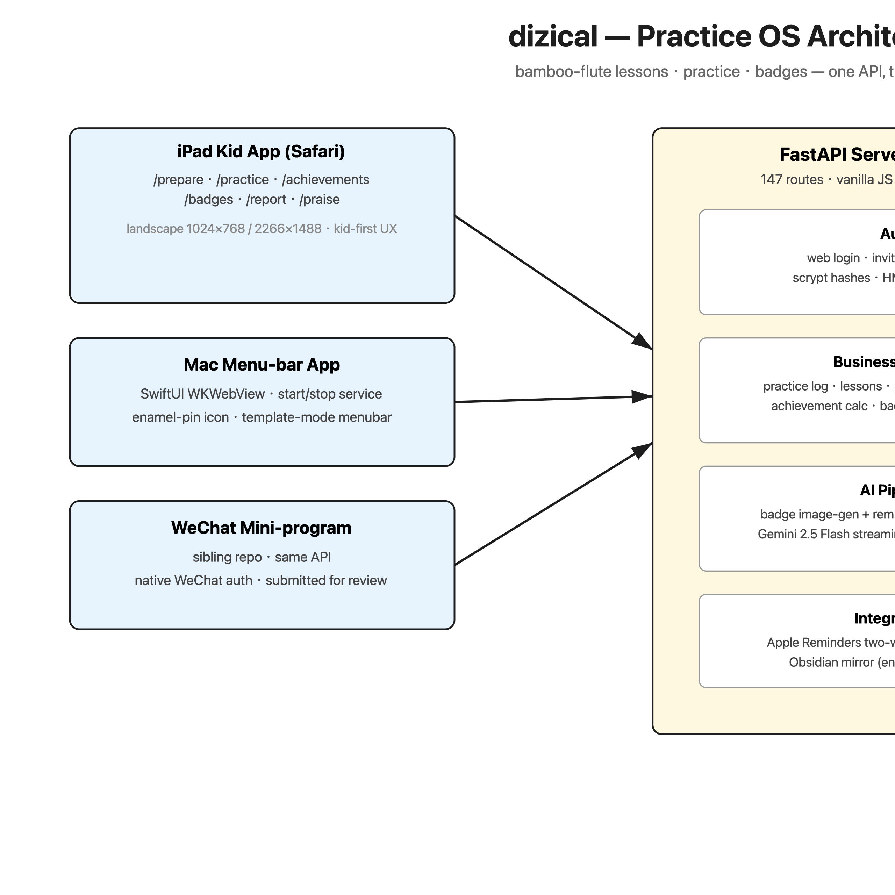
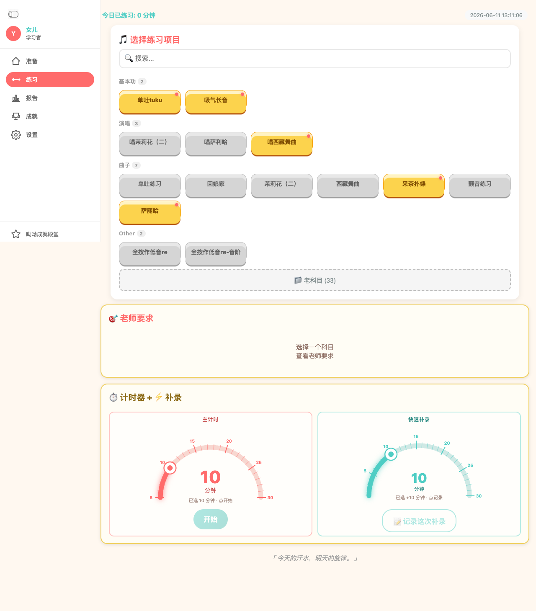
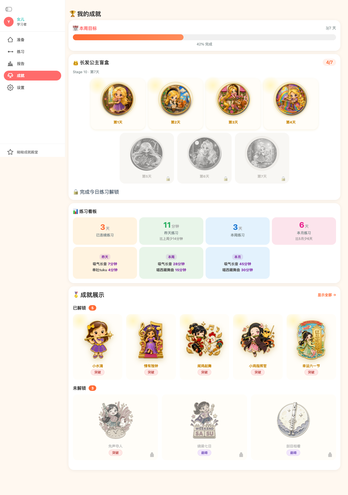
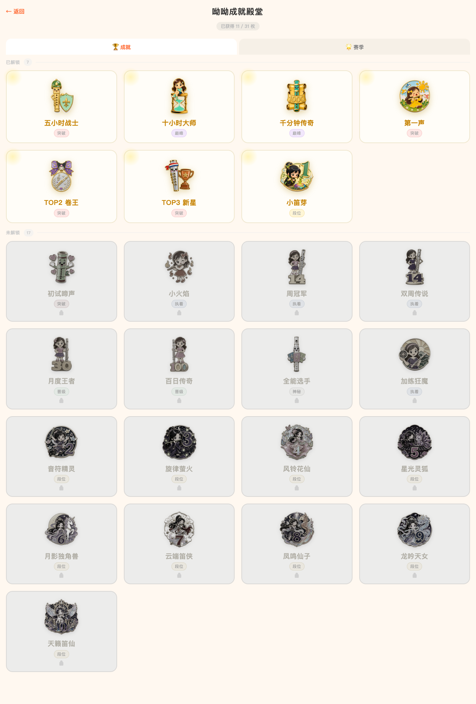
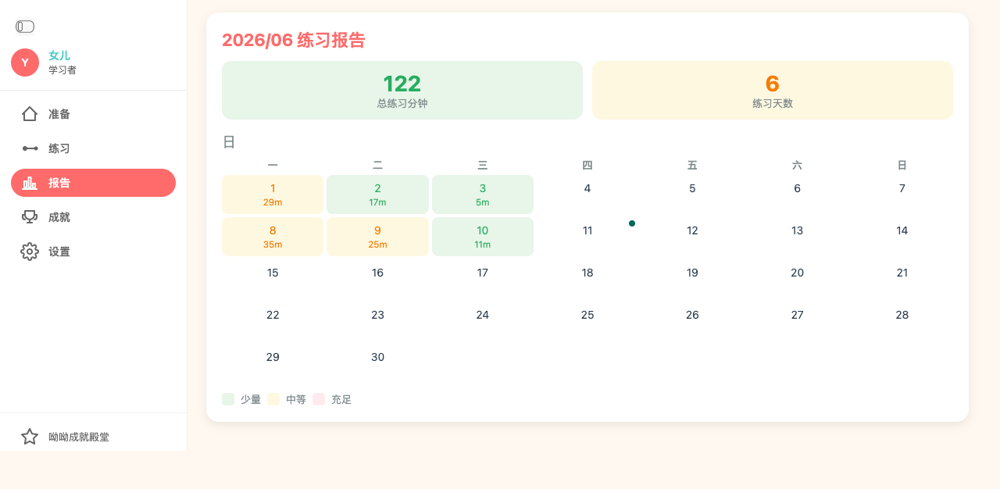
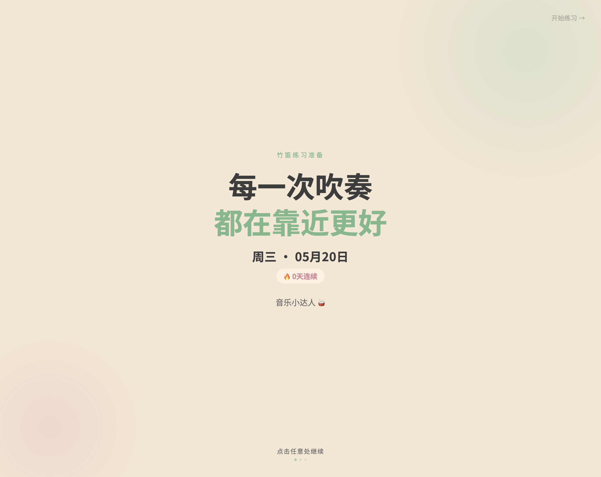

# 🎵 dizical

[English](./README_EN.md) · [中文](./README.md)

> A production-grade practice-management system for Chinese bamboo flute (dizi) education — lessons, payments, daily practice tracking, teacher assignments, and a gamified enamel-pin badge collection, built for one kid and used every day.

<p align="center">
  
  
  
  
  
  
</p>

---

## Why dizical?

The name is a pun: *dizi* (竹笛, the Chinese bamboo flute) + *cal* (calendar) ≈ **Descartes**. It started as a CLI for a dad to track his daughter's flute lessons and has grown into a full practice OS:



**Real usage**: run in production since 2025, ~211 days of lesson data imported, 527 tests passing, deployed to Tencent CloudRun with a cloud MySQL database.

---

## What it does

### 👧 Kid side (iPad, landscape 1024×768 / 2266×1488)
- **`/prepare`** — GSAP scroll-driven daily prep checklist, teacher's weekly assignments with images
- **`/practice`** — 3-floor subject picker, dual semi-circle duration dials, session timer with finish-protection (a 7-year-old can't swipe away), fuzzy item matching ("单吐" matches "单吐练习"), Apple Reminders two-way sync (type "单吐10分钟" in Reminders → logged practice)
- **`/achievements`** — 7-cell board: streak, weekly delta, monthly delta, cumulative minutes, plus a 7-day blind-box theme row (Rapunzel, etc.)
- **`/badges`** — the enamel-pin collection wall (see below)
- **`/report`** — practice heatmap calendar, stage stacked bars, printable stage sheet (print-first CSS, Noto Serif)
- **`/praise`** — parent-curated encouragement pool

### 🏆 Badge engine (V2, 2026-07)
- **40+ enamel-pin style badges** across 6 categories — streak (1/3/7/14/30/100 days), cumulative minutes, grade milestones, monthly top-3, festivals (Children's Day per-year), special events
- **Real-time calc + auto-unlock** — `calc_all()` persists to `achievement_stats`; locked state is pure CSS grayscale (no fake locked images)
- **Kid-voice unlock copy** — "你在 2025-10-03 第一次连着打卡 7 天" instead of engineering jargon
- **AI-generated artwork** — each pin is generated via image-gen + rembg U2-Net background removal, 1024×1024 RGBA with hard alpha mask; the whole pipeline is a documented draft-JSON contract (`data/lib/badge_data/{draft_id}.json`) between the backend and the image pipeline
- **7-day blind-box themes** — 7 matching pins per theme (Rapunzel, ocean), all sharing one art direction

### 👨👩 Parent side
- **Lesson scheduling** — auto-generate weekly lessons on Saturday, holiday conflict detection, fee tracking with payment reminders on lesson day
- **`/config/lessons`** — month calendar with status dots, one-click plan generation, fee statistics
- **`/config/records`** — practice heatmap editor, history editing, AI-generated monthly report infographic (multi-template: academic/fresh/sport/fun)
- **`/config/*` admin** — subjects, badge management, users (web auth with invite links + whitelist), PIN-protected

### 👩🏫 Teacher side
- **Weekly assignments** with stage-based progression (7-day cycles), stage_start/stage_end/stage_order
- **Item-level requirements** with fuzzy name matching, image attachments, latest-requirement auto-preset

---

## Quick start

```bash
git clone https://github.com/mariusiaowego-commits/dizical.git && cd dizical
pip install -e ".[dev]"          # or: uv sync --group dev
dizical kid start                # → http://localhost:8765 (iPad: <your-ip>:8765)

# CLI
dizical lessons list
dizical practice category list
dizical reminders sync           # two-way Apple Reminders sync
```

No `.env` required for local dev — SQLite + zero-config defaults. For the cloud path, set `DATABASE_URL` (MySQL) and the app switches backends automatically via `src/db_adapter.py`.

---

## Tech stack

| Layer | Choice | Why |
|-------|--------|-----|
| Backend | Python 3.10+ · FastAPI · uvicorn | async, typed, batteries-included |
| Data | **SQLite ↔ MySQL dual backend** | `src/db_adapter.py` + `src/database_mysql.py` (53-method MySQL mirror of the SQLite `Database` class); same SQL via `?` → `%s`, switched by `DATABASE_URL` env |
| Frontend | Vanilla JS + GSAP (no React, no npm build step) | zero toolchain, readable by anyone |
| Clients | iPad Safari · Mac menu-bar app (SwiftUI WKWebView) · WeChat mini-program (sibling repo) | one API, three surfaces |
| Deploy | Tencent CloudRun (container) + CloudBase COS | home-server app that actually cut over to cloud MySQL |
| Design | **dizicute design system** — see [DESIGN.md](./DESIGN.md) | 6-color coral `#FF6B6B` palette, 4 type scales, 7 components, WCAG-aware |
| AI | Gemini 2.5 Flash (streaming) · image-gen + rembg for badges · GPT-4o report infographics | |

**Why this is interesting**: a single family app that grew a real dual-database abstraction, a documented AI image pipeline, a design system, and three client surfaces — all in vanilla Python + JS with no framework lock-in.

---

## Screenshots

| Practice | Achievements | Badges |
|----------|-------------|--------|
|  |  |  |

| Report | Prepare |
|--------|---------|
|  |  |

---

## Repository layout

```
src/
  kid_app/            # FastAPI web app (147 routes)
    routes/           # config / practice / achievements / badges / auth ...
    templates/        # vanilla HTML (practice.html 2788 lines, print-first CSS)
    static/           # style.css tokens + badge assets
  backup.py           # SQLite backup + iCloud mirror (env-configured)
  db_adapter.py       # SQLite/MySQL dual-backend switch
  database_mysql.py   # 53-method MySQL mirror
  models.py           # pydantic settings
scripts/              # deploy / validate / backup tooling (path-relative)
tests/                # 11K lines, 527 passing
docs/                 # workflow docs, CHANGELOG, badge-image workflow
channels/             # Mac menu-bar app (SwiftUI)
```

---

## Docs

- [中文 README](./README.md)
- [Design system (dizicute)](./DESIGN.md)
- [Badge image workflow](docs/badge-image-workflow.md)
- [CHANGELOG](docs/CHANGELOG.md)
- [API changelog](API-CHANGELOG.md)

---

## License

[MIT](./LICENSE) — code, not data. The repo ships no personal data; the live instance is a private family deployment.
