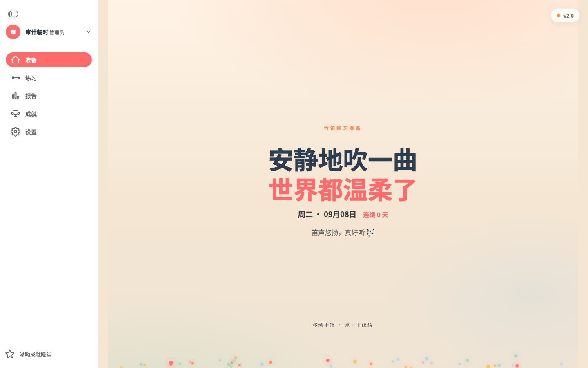
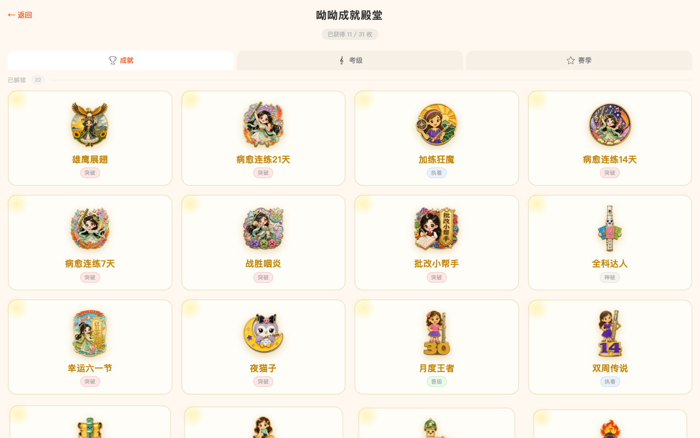
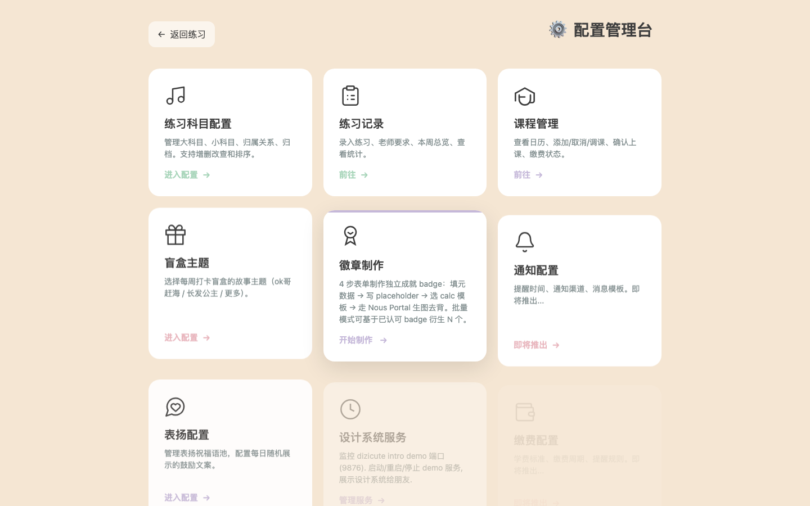
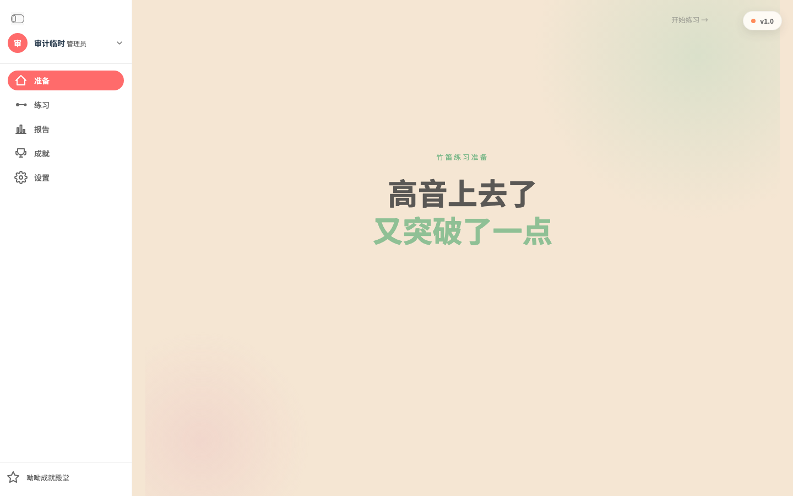
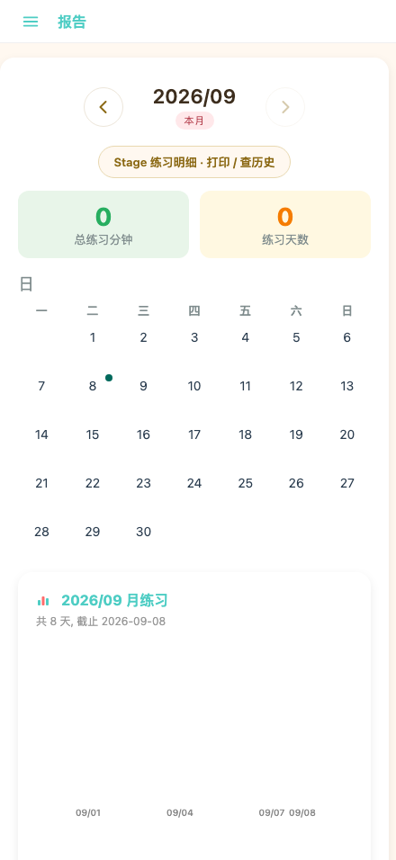
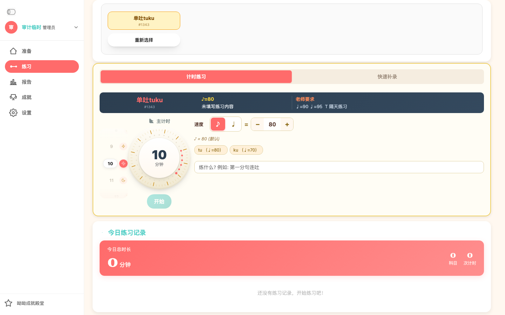
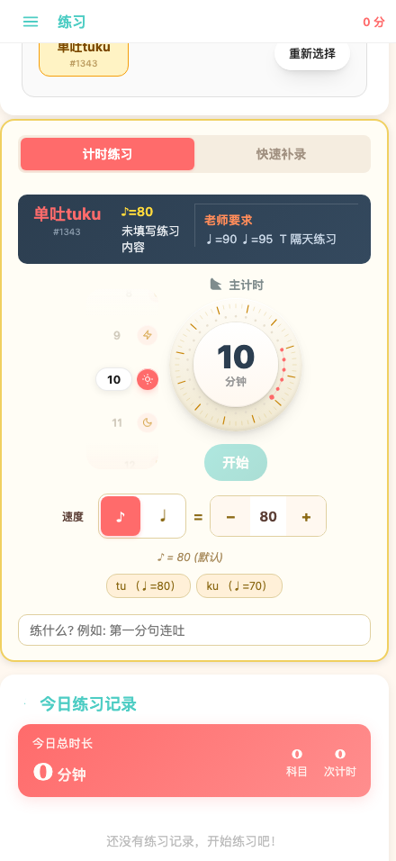
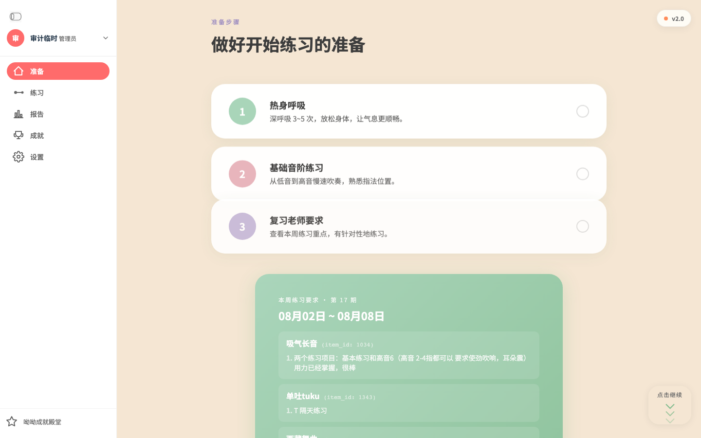
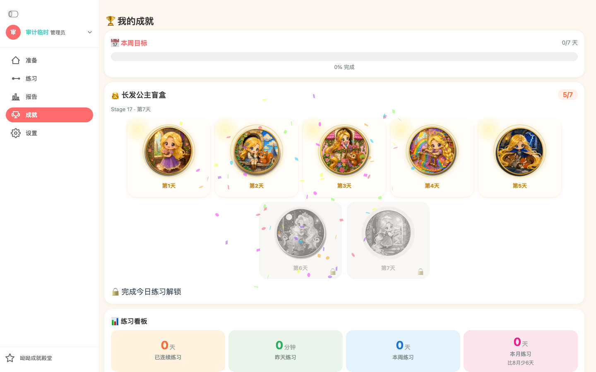

# dizical 前端交互 / UI 体验审计

> 2026-09-08。走查本地同一套模板（沙盒 SQLite，端口 8770），**不是** 8765 云库登录。截图在 `docs/screenshots/uiux-audit-2026-09-08/`。
> 未在真机 Safari / WKWebView 上点；iPhone / iPad 结论来自视口模拟。

## Anti-Patterns 结论

**不是一份「一眼 AI 生成」的界面。** 孩子侧有自己的味道：珐琅盲盒、珊瑚红侧栏、准备页大字祝福、计时旋钮。这不是 cyan-on-dark / Inter / 玻璃拟态那一套。

真正的问题是 **三个产品叠在一个壳里**：

| 层 | 代表页 | 气质 |
|---|---|---|
| 孩子仪式 | `/prepare` v2 | 珊瑚红大字、粒子、编辑气质 |
| 孩子工具 | `/practice` `/achievements` `/badges` | 暖白 + 黄科目钮 + 珐琅徽章 |
| 家长后台 | `/config/*` | 米色 + sage/薰衣草 + 线框图标卡片墙 |

配置台是最像模板的一块：相同尺寸卡片 + 线框图标 + 标题 + 一段说明。孩子侧一旦进入配置，品牌立刻断掉。

`UIUX_STYLE.md`（底栏 5 tab、emoji 丰富）已经过时。现行壳是左侧 rail / 窄屏抽屉。文档和界面不同步。

---

## 执行摘要

| | |
|---|---|
| 走查页 | 登录、改密、管理员登录、准备、练习、成就、徽章墙、报告、Stage 打印、配置枢纽 + 7 个子页 |
| 问题合计 | **Critical 4 · High 11 · Medium 12 · Low 若干** |
| 综合 | **孩子视觉 8 / 交互 6；配置视觉 5；无障碍 3；跨页一致性 4。总分约 6.2/10** |
| 最大机会 | 把「早课仪式 → 选科目 → 拧旋钮 → 开始」收成一条主路径，其余藏进设置 |

最值得先做的 5 件事：

1. `/praise` 现在 302 到配置 PIN 门，孩子进不去表扬页。
2. 登录后 `/` 直接进练习，准备页被跳过。
3. 报告月历多了一个孤零零的「日」，格子对不齐。
4. 准备页老师要求里把 `item_id: 1034` 暴露给孩子。
5. 全站 `user-scalable=no`，Safari 放大被关掉。

---

## 做得好的地方

1. **盲盒 / 徽章是品牌资产。** 长发公主主题珐琅章、锁定用 CSS 灰度、点开有故事。这是孩子会记住的东西。
2. **练习页选科目的收拢。** 点「单吐 tuku」后网格收成摘要 +「重新选择」，符合「按钮只放名字、选中后收拢」。
3. **窄屏练习没有砍功能。** 440 宽上旋钮、速度、内容标签、开始，是竖排而不是藏起来。这点比很多桌面改手机做得干净。
4. **侧栏有正经的焦点环。** Tab 到折叠按钮时，珊瑚红外圈是看得见的。
5. **登录失败有文案。** 「用户名或密码错」出现在表单上方，不是空白刷新。





---

## Critical

### C1. `/praise` 已死，孩子进配置 PIN

- **位置**: `app.py` `praise_page()` → `RedirectResponse("/config")`
- **现象**: 打开 `/praise` 看到的是「🔐 管理台验证」，不是表扬海报。
- **影响**: 侧栏没有表扬入口，旧书签 / 表扬页本身变成家长门。孩子路径断了。
- **建议**: 表扬留在孩子信息架构里；配置里的祝福池另开。不要用 302 把孩子页并进 PIN。

### C2. 全站禁止双指缩放

- **位置**: 几乎所有模板 `user-scalable=no` / `maximum-scale=1.0`（`prepare.html`、`practice.html`、`achievements.html`、`report.html`、全部 config 页）
- **标准**: WCAG 1.4.4 Resize text（A）
- **影响**: 7 岁孩子 + 家长共用 iPad，看不清老师要求长文时无法放大。
- **建议**: 去掉 `user-scalable=no`，用排版解决「误放大」，不要关缩放。

### C3. PIN 明文进 localStorage

- **位置**: `config.html` `localStorage.setItem('config_pin', pin)`
- **影响**: 任何脚本、共享 iPad 上的 DevTools 都能读到管理员 PIN。侧栏已经登录了还要二次 PIN，门的形态也不统一（有的页 cookie，有的页 localStorage）。
- **建议**: 只留已有的 `dizical_pin_ok` 签名 cookie，删 localStorage 里的 PIN。

### C4. 原生 `alert` / `confirm` 仍是主反馈

- **位置**: `practice.html`、`config-practice-log.html`、`config-lessons.html`、`config-users.html`、`_sidebar.html` 等，几十处
- **影响**: iPad Safari 系统框会打断计时心流；孩子看不懂「确定要删除这条额外练习记录吗？」。练习页 2026-05 审计已经说过，仍在。
- **建议**: 练习用已有的 `#finishEarlyModal` 那套；配置用 toast / 行内错误。

---

## High

### H1. 三个视觉系统，登录后品牌跳变

孩子页暖白 + 珊瑚；配置枢纽米色 + sage；用户管理又是灰底 + 珊瑚 CTA。侧栏「设置」一按，像进了另一个网站。



配置卡文案还在讲 `placeholder`、`calc 模板`、`Nous Portal`——这是给 agent 看的，不是给 dad 扫一眼的。

**建议**: `/normalize` 把 config 收进 dizicute 6 色；「即将推出」卡直接不渲染，不要用几乎看不见的米色幽灵卡。

### H2. 登录落地跳过准备页

```python
target = "/report" if role in ("family", "reviewer") else "/practice"
```

dad / 孩子打开 `/` 进练习。准备页的祝福、热身步骤、本周要求变成要专门点「准备」才看得到。早课 7:15 的仪式被跳过。

准备页右上角还有 **v2.0 / v1.0 切换**，写进 `localStorage`。孩子误触会整页换皮肤，而且会带到下次打开。



**建议**: 孩子账号 `/` → `/prepare`；版本开关只留 `?ui=v1` 给 debug，不要做成常驻控件。

### H3. 报告月历多一个「日」

`report.html` 在星期行上面残留：

```html
<div style="margin-bottom:8px;color:#7F8C8D;">日</div>
```

手机上特别明显：格子和星期对不齐。



**建议**: 删掉这行。月历本身的「一…日」已经够了。

### H4. 孩子界面出现 `item_id`

准备页本周要求：`吸气长音 (item_id: 1034)`。练习选中摘要：`#1343`。AGENTS 写过「ID 放选中摘要」是给 dad 的，不该出现在准备仪式卡上。

老师要求原文 `J=90 J=95 T 隔天练习` 对 7 岁也不友好。仪表盘已经用「速度 / 内容」翻译过一遍，摘要区可以显示「隔天练 · 速度 90/95」，把 `J=` `T` 留给配置。

### H5. 「开始」不是品牌主色，启用态不够硬

`.btn-primary` 是青绿渐变 `#4ECDC4`，不是珊瑚红。禁用 `opacity: 0.45`。选科目后按钮变实，但：

- 主操作看起来像次要按钮
- 未填「练什么」时开始仍可点，失败靠 `alert('请填写本次练习内容后再打卡')`
- 仪表盘写着「未填写练习内容」，开始钮自己不解释



**建议**: 开始用珊瑚红；没选科目 / 没填内容时保持 disabled，并把原因写在按钮下，不要 alert。

### H6. 选中后有两个「重新选择」

摘要里一颗，下方曾经还有 `#reselectFloat`。窄屏上摘要行把科目名和「重新选择」挤在同一行，`#1343` 还占位置。



**建议**: 只留摘要里一颗。手机上科目名单独一行，操作钮单独一行。

### H7. 选中后的海军蓝仪表盘

`.dash-card-inline`：`linear-gradient(#2C3E50, #34495E)`。9 月 4 日 practice UI 方案已标 P0「黑底改暖白」，还在。手机上「未填写练习内容」折行，和黄科目卡、珊瑚侧栏抢注意力。

### H8. iPad mini 竖屏被当成手机

断点 `max-width: 1099px` → 抽屉。iPad mini 竖屏 744 是孩子主设备之一，却是汉堡 + 顶栏，不是 rail。横屏 1133 才是侧栏。竖屏 / 横屏信息架构不一样，旋转即换壳。

**建议**: 把 rail 下放到 640 或专为 744 留「窄 rail」。不要让主设备走手机壳。

### H9. 登录页把管理员引导暴露给所有人

「首次使用 / username `dad` / 初始密码见 `/tmp/dizical-8765.log`」写在登录卡里。孩子或家庭账号也会看到路径和角色名。「管理员登录 ↗」和这段重复。

**建议**: 这段只放 `/admin-login`。普通登录只留用户名、密码、记住 30 天。

### H10. `/badge` 404，真入口是 `/config/badge`

打开 `/badge` 得到 `{"detail":"Not Found"}` 的裸 JSON。配置枢纽「徽章制作」链到 `/config/badge`。书签和口头路径会撞墙。

### H11. 用户管理页把 sprint 号写进标题

`dizical 用户管理 (Sprint 26081003)`。角色徽章「管理员」在窄列里折成「管理 / 员」。行内 4 个操作钮挤在一起。

---

## Medium

| ID | 问题 | 为什么要紧 |
|---|---|---|
| M1 | 成就 / 报告 / 准备仍留着已删除底栏 `.nav` 的 CSS，`padding-bottom: 80px` | 底部莫名空白，像少了一截 |
| M2 | 成就标题用 🏆📅🏅，`style.css` 已写 emoji ban | 和 koboyo SVG 混用，iOS 上大小不一 |
| M3 | 锁定盲盒也在撒彩纸 | 未解锁却在庆祝，语义反了 |
| M4 | 成就看板 4 个大 0 的 hero metric | 没练过的日子像空仪表，不像「去按开始」 |
| M5 | 徽章墙没有侧栏，只有「← 返回」 | 从殿堂回练习要多一跳 |
| M6 | 表单 `outline: none`（登录、改密、PIN、大量 config） | 键盘用户只在侧栏看得到焦点 |
| M7 | 配置课表日期框 placeholder `mm/dd/yyyy` | 中文家长界面出现英文日期格式 |
| M8 | PIN 输错走 catch，文案是「验证失败，请重试」，输入没清空 | 和「PIN 不对哦」不是同一条路 |
| M9 | 练习页 `confirm()` 删记录 | 和 C4 同类，练习中误触代价高 |
| M10 | Stage 打印工具条控件极密，小「展开」 | dad 工具可以密，但触控目标偏小 |
| M11 | 准备步骤右侧空心圆，看起来像 checklist，点了没勾选反馈 | 错误 affordance |
| M12 | 本周要求卡上的「点击继续」浮动钮盖住内容 | 挡阅读 |



---

## 按页走查（交互，不只观感）

### 登录 `/login`

空提交走浏览器原生校验（红框，无中文说明）。错密码有红条。成功进 `/practice`。默认勾选「记住 30 天」适合 iPad。管理员引导不该出现在这里（H9）。

### 准备 `/prepare`

v2 是全站最有设计方向的一屏。问题是默认看不到（H2）、版本开关常驻、老师要求泄漏内部 ID（H4）。v1 的「开始练习 →」对比度不够，几乎隐身。

### 练习 `/practice`

主路径清楚：选科目 → 拧 10 分钟 → 开始。旋钮有辨识度。科目黄钮 + 红点 = 有老师要求，学得会。

摩擦点：开始是青绿（H5）；海军蓝仪表盘（H7）；内容没填靠 alert（C4）；快速补录 tab 换成橙色，一时两个「主色」；`alert` 打卡失败。

手机上旋钮缩小到 148px，速度行到 44px，这是对的。选中后顶栏摘要太挤（H6）。

### 成就 `/achievements`

盲盒一行是高潮。点章出故事模态，关钮明确。手机 2 列合适。问题：emoji 标题、锁定也撒花、下方 0 看板、底栏 CSS 残留。



### 徽章墙 `/badges`

收集页该长这样。缺侧栏（M5）。「已获得 11 / 31」和「已解锁 22」对不上，孩子会问。

### 报告 `/report`

月切、本月标记、Stage 打印入口都在。Critical 视觉 bug 是多余的「日」（H3）。空月是两个大 0 + 空白图，没有「去练习」的下一步。点日期有明细区，空数据时几乎无反馈。

### Stage 打印 `/report/stage-print`

给 dad / 老师看的密工具，分组/表格/导出齐全。和孩子页完全两套，可以接受。键盘横滑方案（`docs/keyboard-a11y-plan.md`）还没落地。

### 配置枢纽 `/config`

PIN 门用 sage 按钮，和登录珊瑚红不一致。错 PIN 文案走 catch（M8）。通过后卡片 stagger 动画让后排像禁用。用户、设计、通知、缴费有的「即将推出」对比差到几乎读不了。

### 配置子页

练习科目主从栏清楚，悬停才出归档/删除，适合 dad。练习记录是另一套左栏（录入 / 老师要求 / 本周 / 统计），和枢纽、孩子侧栏加起来 **三套导航**。课表 `mm/dd/yyyy`（M7）。用户页 sprint 号（H11）。

---

## 系统性模式

1. **Token 漂移。** dizicute 只有 6 色。实际出现 `#4ECDC4`、`#F5e6d3`、`#a8d5ba`、`#c5b8d9`、`#2C3E50` 渐变底、`#FF8C5A` tab、无数 inline hex。`style.css` 的 `--secondary: #4ECDC4` 已经和 DESIGN.md 的 `--secondary: #2C3E50` 打架。
2. **导航三代并存。** 孩子 rail / 窄屏抽屉；配置枢纽无侧栏卡片墙；配置子页各自左栏；徽章墙只有返回。底栏 CSS 还没删干净。
3. **孩子文案和内部符号混用。** `item_id`、`J=`、`T`、`CST`、`Nous Portal`、sprint id。
4. **无障碍是欠账。** 禁缩放、`outline: none`、div+onclick 关模态、对比度靠「短字 + 大号」豁免但用在长句上（老师要求）。
5. **文档落后。** `UIUX_STYLE.md` 仍写底栏 5 tab 和 emoji。

---

## 建议顺序

### 立刻（半日级，不改信息架构）

1. 删报告月历多余「日」
2. 准备页去掉 `item_id` 展示
3. `/praise` 不要 302 到 `/config`（先恢复页面或改成明确的「家长入口」）
4. 登录卡去掉 dad 初始密码 / `/tmp/...` 说明
5. 用户管理标题去掉 Sprint 号
6. 删成就/报告残留 `.nav` 底栏 CSS 和多余 `padding-bottom`

### 这一周（练习主路径）

1. 「开始」改珊瑚红；未就绪保持 disabled + 一句原因
2. 去掉海军蓝仪表盘，改暖白（对齐 9-04 方案）
3. 只留一个「重新选择」
4. 练习页 `alert`/`confirm` 换成已有 modal
5. 准备页版本开关移出孩子 UI；`/` 对孩子进准备

### 下一轮（系统）

1. `/normalize`：config 收进 dizicute，幽灵卡删掉
2. `/adapt`：iPad mini 竖屏给 rail，不要汉堡
3. `/harden`：PIN 只走 cookie；打开缩放；焦点环回到输入框
4. `/clarify`：老师要求人话化（隔天练、速度 90）

可用技能：`/normalize` `/adapt` `/harden` `/clarify` `/polish` `/distill`。练习页大改继续沿用 `docs/practice-ui-iter-2026-09-04-integrated.md`，不要另起一套。

---

## 验证范围与限制

| 做了 | 没做 |
|---|---|
| 登录成功/失败、侧栏展开、账号菜单、选科目、切补录 tab、点徽章模态、月历翻月、PIN 对/错、窄屏抽屉 | 真的开始计时 / 写练习（避免脏数据） |
| 440 / 744 / 1133 / 1440 截图 | 真机 Safari、Mac WKWebView、横屏 iPhone |
| 源码核对 alert、viewport、token、路由 | 8765 云库登录（那是生产账号，未动） |

计时、打卡提交、老师视频预览、生成月报图，需要单独用一次性数据再走一遍。

---

## 页面对照

| 路由 | 角色 | 侧栏 | 观感 | 交互主要问题 |
|---|---|---|---|---|
| `/login` | 全员 | 无 | 干净 | 管理员文案泄漏 |
| `/prepare` | 孩子 | 有 | 最好 | 不是落地页；v1/v2 开关；item_id |
| `/practice` | 孩子 | 有 | 好 | 开始色、蓝仪表盘、alert、双重新选择 |
| `/achievements` | 孩子 | 有 | 好 | emoji、锁定撒花、空看板 |
| `/badges` | 孩子 | 无 | 很好 | 缺导航；计数不一致 |
| `/report` | 孩子/dad | 有 | 中 | 月历「日」；空态弱 |
| `/praise` | 原孩子 | — | 死 | 302 → PIN |
| `/report/stage-print` | dad | 无 | 密 | 触控偏小 |
| `/config` | dad | 无 | 模板感 | 三套导航之一；幽灵卡 |
| `/config/practice` | dad | 自有左栏 | 中上 | 和孩子壳断裂 |
| `/config/practice-log` | dad | 自有左栏 | 中 | alert 多；CST 字样 |
| `/config/lessons` | dad | 自有左栏 | 中 | mm/dd/yyyy |
| `/config/users` | dad | 无 | 中 | sprint 号；折行 |
| `/config/badge` | dad | 有 | — | `/badge` 404 |
| `/change-password` | 全员 | 无 | 干净 | 与登录一致，可用 |

截图目录：`docs/screenshots/uiux-audit-2026-09-08/`（约 50 张）。
