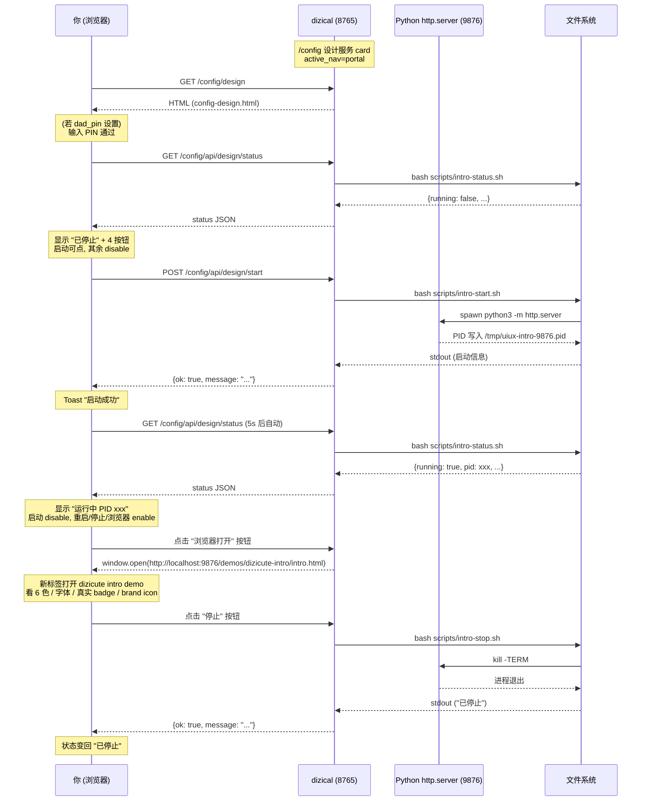

# 使用指南 — dizical 设计系统服务监控

> 给"想用 dizical 管理 dizicute intro demo 服务"的人看的. 大白话 + mermaid 图 + FAQ.

---

## 一句话

> dizical `/config` 配置台加了第 9 张 card "设计系统服务". 点进去能看 9876 端口状态、点 4 按钮启停服务、一键浏览器打开 dizicute intro demo.

---

## 0. 术语解释

| 术语 | 解释 |
|------|------|
| **dizicute** | dizical kid-app 的设计语言 (颜色 / 字体 / 组件). 像"装修风格说明书". |
| **uiux-asset-library** | 另一个项目仓 (`/Users/mt16/dev/uiux-asset-library/`), dizicute 的主权威所在地. |
| **intro demo** | uiux-asset-library 里 `demos/dizicute-intro/intro.html` 那个精致单页 demo, 给"展示 dizicute 给朋友看"用的. |
| **9876 端口** | intro demo 跑在 Python `http.server` 上, 占 9876 端口. 跟 dizical 主服务 8765 端口独立. |
| **设计服务监控** | dizical 里管理 9876 服务的小工具, 让"不用开 terminal 也能启停". |

---

## 1. 整体流程 (mermaid)

```mermaid
flowchart LR
    A[你: 想看 dizicute intro demo] --> B{9876 服务在跑吗?}
    B -->|是| C[浏览器打开 intro demo]
    B -->|否| D[dizical /config/design]
    D --> E[点 "启动" 按钮]
    E --> F[POST /config/api/design/start]
    F --> G[bash intro-start.sh]
    G --> H[Python http.server 起来]
    H --> I[9876 端口在跑]
    I --> C
    C --> J[看完, 不用了]
    J --> K[回 /config/design]
    K --> L[点 "停止" 按钮]
    L --> M[服务停了, 资源释放]
```

---

## 2. 完整时序 (mermaid sequenceDiagram)



---

## 3. 怎么用 — 3 步

### 步骤 1: 进 dizical `/config` 配置台
打开 `http://localhost:8765/config`, 看到 dashboard 卡片网格. 滚到底部找第 9 张 card "设计系统服务" (lavender 紫色, SVG 仪表盘 icon).

### 步骤 2: 点 "管理服务" 进子页
点第 9 张 card, 进入 `http://localhost:8765/config/design`.

- **如果 dad_pin 设置了**: 弹 PIN 输入框, 输入 PIN 通过. (跟 config-badge / config-blindbox 一致)
- **如果是给别人看**: 用 `http://localhost:8765/config/design?demo=true` 直接进, 不需 PIN.

### 步骤 3: 看状态 + 操作
子页显示:
- **状态卡片**: 顶部大圆点 + "运行中 PID xxx" / "已停止"
- **进程信息**: PID / 端口 9876 / 启动时间 / 运行多久 / 访问 URL
- **4 操作按钮** (dizicute 暖色):
  - 🟢 启动 (运行时灰掉)
  - 🟡 重启 (停止时灰掉)
  - 🔴 停止 (停止时灰掉)
  - 🔵 浏览器打开 intro demo (停止时灰掉)
- **使用说明**: 底部卡片, "什么时候需要" 4 条

按钮点击 → toast 反馈 (启动中... → 启动成功) → 5s 自动刷新状态.

---

## 4. PIN vs Demo 模式 — 怎么选

| 场景 | URL | 行为 |
|------|-----|------|
| **你自己管理服务** (启停改配置) | `/config/design` | 需 PIN (跟 config-badge 一致) |
| **展示给朋友看** (只看不操作) | `/config/design?demo=true` | 不需 PIN, 直接看 UI |

**?demo=true 模式** 按钮**全部可用** (没 PIN 阻挡), 因为你的朋友只是看, 不是改 dizical 配置. 如果要更严: 我可以让 demo mode disable 按钮 — 但你拍板 "展示给朋友看" 是核心 use case, 保持按钮可点.

---

## 5. 4 个按钮详解

### 启动 (绿色 sage)
- 行为: 调 `bash scripts/intro-start.sh`
- 脚本做的事:
  1. 检查 9876 端口空闲 (lsof)
  2. 绝对路径 `/usr/local/bin/python3` 启 `http.server --bind 0.0.0.0`
  3. PIDFILE 写入 `/tmp/uiux-intro-9876.pid` (内容是 epoch timestamp, 给 status.sh 算 uptime)
  4. 2s 存活检查, 失败回滚
- 已运行再点: 返 `ok=true + "already running"`, 不重复启动

### 重启 (紫色 lavender)
- 行为: stop + start 组合
- 适用场景: 改了 intro.html 后想看最新效果
- 时序: stop 后等 2s 再 start (端口释放需要时间)

### 停止 (红色 rose)
- 行为: 调 `bash scripts/intro-stop.sh`
- 脚本做的事:
  1. 优先用 PIDFILE 的 PID
  2. 兜底用 lsof 找端口占用进程
  3. SIGTERM 优雅停 → 等 3s → 兜底 SIGKILL
  4. 清 PIDFILE

### 浏览器打开 (灰色)
- 行为: `window.open('http://localhost:9876/demos/dizicute-intro/intro.html')`
- 前提: 服务在跑 (按钮自动 disable 停止状态)
- 效果: 新浏览器标签打开 dizicute intro demo (含 6 色 / 字体 / 真实 badge)

---

## 6. FAQ

### Q1: 为什么 dizical 主服务 8765 没受影响?
A: 端口 9876 独立. PIDFILE 在 `/tmp/uiux-intro-9876.pid`, 跟 `/tmp/dizical-8765.pid` 不冲突. 脚本风格跟 `start-prod.sh` / `stop-prod.sh` 一致, 但完全隔离.

### Q2: 我能在 iPad 上访问 intro demo 吗?
A: 是. 服务绑 `0.0.0.0`, iPad 跟 Mac 同 WiFi 时可以 `http://10.0.0.43:9876/demos/dizicute-intro/intro.html` 访问 (Mac 实际 IP, ifconfig 查). 跟 dizical 8765 服务同模式.

### Q3: 服务忘了关, 一直占资源怎么办?
A: Python `http.server` 是单进程, 内存占用很小 (~10MB). CPU 0% (没请求时). 不影响 Mac. 但养成习惯: 看完 demo 立刻点 "停止" 释放端口.

### Q4: 我能在 terminal 启/停服务吗?
A: 是, 跟 dizical CLI 同风格:
```bash
cd /Users/mt16/dev/dizical
./scripts/intro-start.sh        # 后台启
./scripts/intro-stop.sh         # 优雅停
./scripts/intro-restart.sh      # 重启
./scripts/intro-status.sh       # JSON 状态
```

### Q5: 我能把 demo URL 加到 dizical sidebar 让女儿看吗?
A: 不建议. 这服务是给"你展示设计系统给朋友"用的, 女儿不需要. dizical sidebar 5 tab (准备/练习/成就/报告/设置) 保持纯净. 如果未来女儿要看自己成就 demo, 走 `/badges` 页面 (已有).

### Q6: 服务异常 crash 怎么办?
A: 两种情况:
1. **PIDFILE stale + 端口占用**: status.sh 检测到 PID 已死但端口被占, 返 `{running: false, stale: true}`. 点 "停止" 清干净再点 "启动".
2. **启动失败**: intro-start.sh 2s 存活检查失败, 自动回滚 + 清 PIDFILE + 返错误日志. 你看 toast 提示, 通常是端口占用或 Python 路径问题.

### Q7: 这个服务安全吗? 会被别人访问吗?
A: 绑 `0.0.0.0` (跟 dizical 8765 一致). 同 WiFi 的人理论上能访问. 但:
- intro.html 是静态内容, 没敏感数据
- PIN 验证保护"管理"操作, 但 `?demo=true` 模式任何人可看
- Mac 防火墙默认拦截外部访问, 实际只有同 WiFi 能进

### Q8: 我能用 mac app 启停这个服务吗?
A: 不能 (用户拍板: 不集成进 mac app). 走 dizical `/config/design` 页面管理. mac app 只管 8765 主服务.

### Q9: 状态里的 "uptime" 怎么算?
A: PIDFILE 写入 epoch 时间戳, status.sh 用 `date +%s - PIDFILE 时间` 算差值. 不查 `ps` (不引 psutil 依赖). 简单可靠.

### Q10: 我能改 intro demo 路径吗?
A: 路径在 `scripts/intro-start.sh` 第 47 行 `UIUX_ROOT="/Users/mt16/dev/uiux-asset-library"`. 改这个变量 + 重启服务即可. 但不推荐改, dizical 跟 uiux-asset-library 解耦, 路径是固定约定.

---

## 7. 关联文件

- dizical 仓:
  - `scripts/intro-{start,stop,restart,status}.sh` — 4 脚本
  - `src/kid_app/routes/config.py` — `config_design()` 路由 + 4 API endpoint
  - `src/kid_app/templates/config-design.html` — UI 模板
  - `src/kid_app/templates/config.html` — 第 9 张 dashboard card
  - `tests/test_config_design.py` — 5 端到端测试
- uiux-asset-library 仓:
  - `demos/dizicute-intro/intro.html` — 被管理的 demo
- 文档:
  - `docs/使用指南-design服务.md` (本文件)
  - `docs/使用指南-徽章制作.md` — 同风格参考
- wiki / Obsidian:
  - `hermes-base/projects/project-dizical.md`
  - `tqob/05-Coding/project-dizical/`
- plan:
  - `/Users/mt16/.hermes/profiles/coder/.hermes/plans/2026-06-15-design-service-monitor.md`
