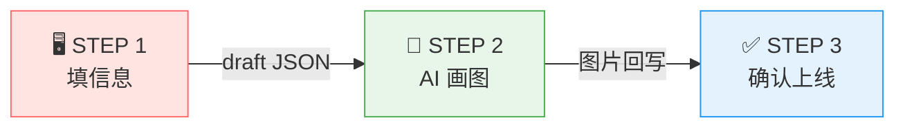
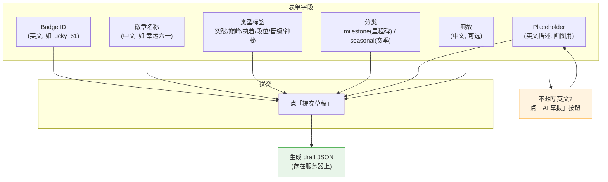
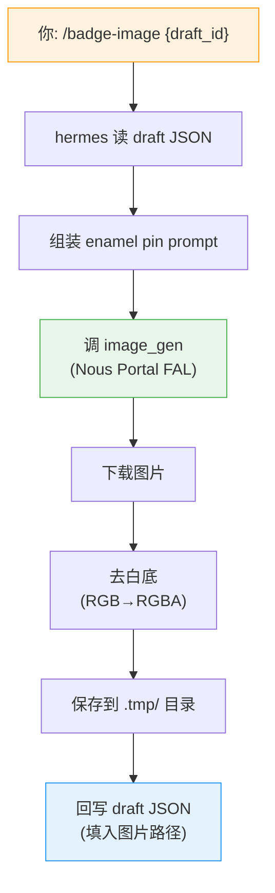
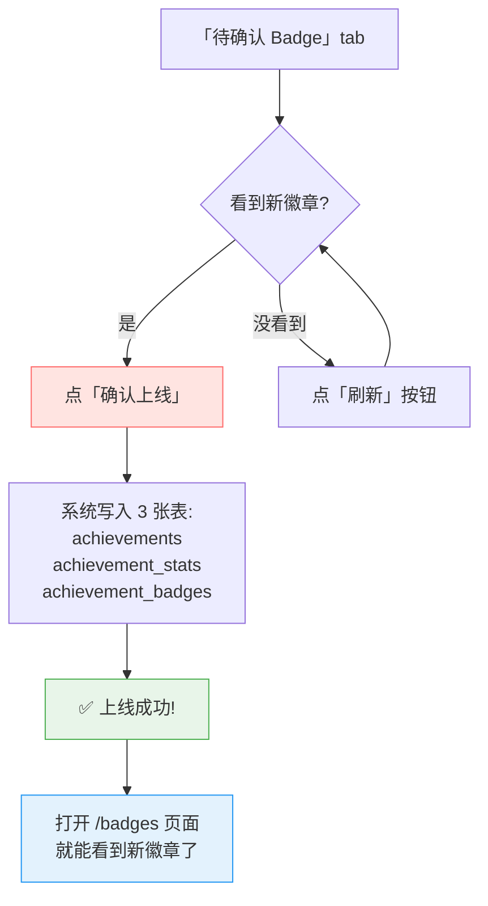
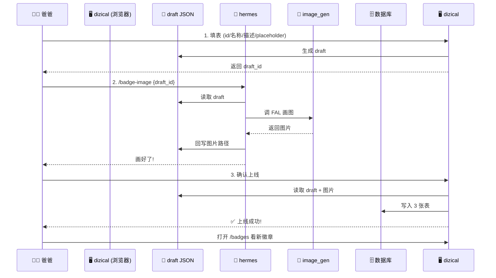
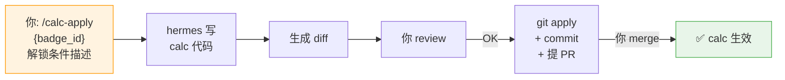

# dizical 徽章制作使用指南

## 一句话概括

**你在浏览器里填好徽章信息 → hermes 帮你画图 → 你确认后一键上线.**

---

## 这东西解决什么问题?

以前做一个新徽章, 你得:
1. 跟 AI 聊半天确认徽章叫什么、什么条件解锁
2. 让 AI 画图, 手动保存
3. 手动去白底
4. 手动写数据库 (3 张表, 写错一张就出 bug)
5. 手动改计算逻辑代码
6. 手动验证

**现在只要 3 步, 全程浏览器操作, 不碰代码.**

---

## 3 步流程 (总览)

---

## STEP 1: 填信息 (你在浏览器操作)

**在哪**: 打开 `http://localhost:8765/config/badge` → 点"新建 Badge 草稿" tab

**做什么**: 填一张表, 告诉系统这个徽章的基本信息

**提交后**: 系统生成一个 `draft_id` (一串字母数字), 复制它, 交给 hermes.

---

## STEP 2: AI 画图 (hermes agent 操作)

**在哪**: hermes chat (命令行或 Alcove)

**做什么**: 告诉 hermes "帮我画这个徽章的图"

**大约需要**: 30-60 秒 (画图慢, 其他都快)

**如果 Portal 挂了**: 会生成一个 1x1 透明占位图, 不阻塞流程, 后续可以补画.

---

## STEP 3: 确认上线 (你在浏览器操作)

**在哪**: `http://localhost:8765/config/badge` → 点"待确认 Badge" tab

**做什么**: 看到 STEP 2 画好的图, 确认没问题就上线

**上线后**: 不需要重启服务, 刷新 `/badges` 页面就能看到新徽章.

---

## 完整流程图

---

## calc 逻辑 (解锁条件)

**徽章上线后, 还需要告诉系统 "什么条件算解锁这个徽章".**

这个叫 calc 逻辑, 走另一个 skill:

**注意**: calc 跟画图是完全分开的. 你可以先上线徽章 (没 calc), 后面再补 calc 逻辑.

---

## 关键概念

| 术语 | 大白话 |
|------|--------|
| **draft** | 草稿, 你填的表单数据, 存成 JSON 文件 |
| **draft_id** | 草稿编号, 一串字母数字, 用来告诉 hermes "画哪个" |
| **enamel pin** | 徽章的视觉风格 (掐丝珐琅 + 金边 + Q版) |
| **placeholder** | 英文描述, 告诉 AI "画什么内容" |
| **milestone** | 里程碑徽章, 达成某个成就解锁 (如"连续练 7 天") |
| **seasonal** | 赛季徽章, 某个时间段内达成 (如"6月每天早起") |
| **calc** | 计算逻辑, 告诉系统 "满足什么条件算解锁" |
| **Portal** | Nous Portal, 生图服务的通道, 挂了就用占位图 |

---

## 常见问题

**Q: Portal 不可用怎么办?**
A: 徽章能正常上线, 只是图片是 1x1 透明占位. 等 Portal 恢复后可以重新画图.

**Q: 上线后发现名字写错了?**
A: 目前需要手动改数据库. 未来可能做编辑功能.

**Q: 一个徽章可以有多张图吗?**
A: 可以, 每次"重新画图"会产生新版本 (v1, v2, ...), 旧版本保留.

**Q: 批量做 10 个徽章呢?**
A: 目前不支持批量. 每个徽章走一次 STEP 1-3.

---

## 文件位置

| 文件 | 干什么用 |
|------|---------|
| `data/lib/badge_data/{draft_id}.json` | 草稿数据 |
| `data/lib/badge_data/.tmp/{draft_id}_v{n}.png` | 徽章图片 (未上线) |
| `src/kid_app/static/badges/{id}.png` | 徽章图片 (已上线) |
| `src/achievement_definitions.py` | calc 逻辑代码 |
